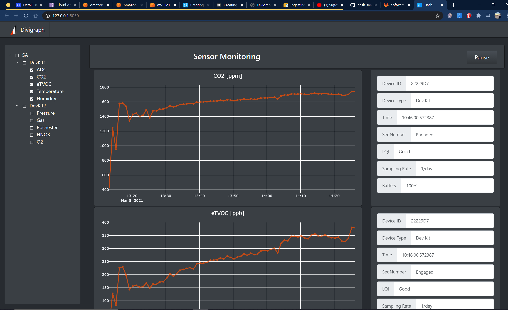
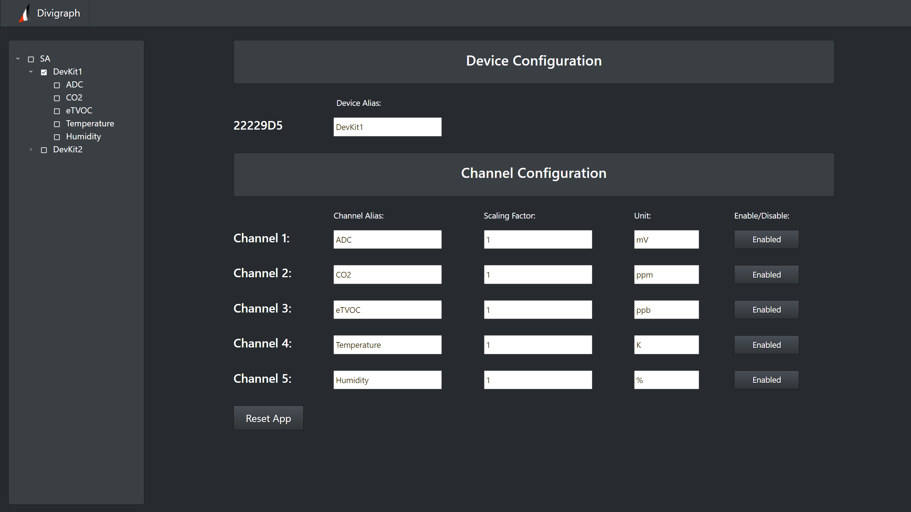
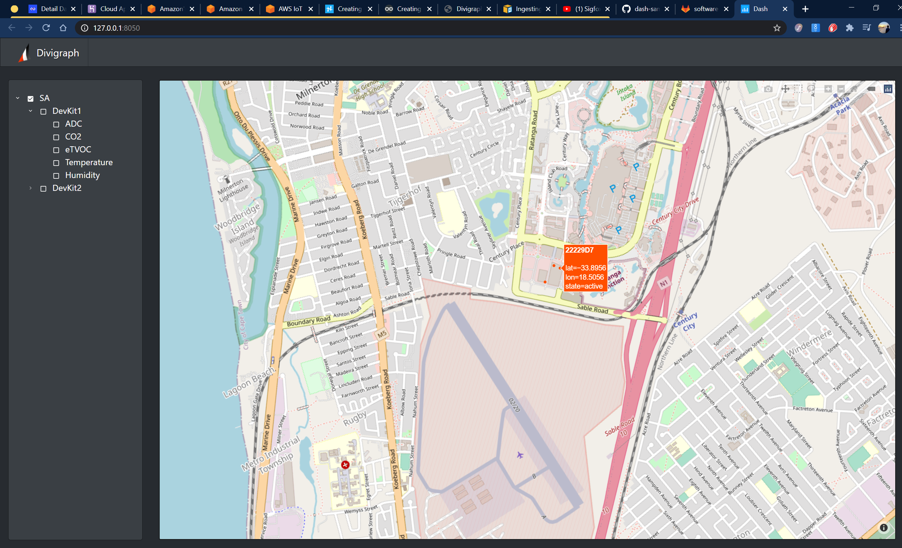

# Sigfox Demo

## About this app

This demo retrieves Sigfox data from AWS and visualizes it in a Dash GUI.
main.py runs the GUI. aws_app.py retrieves the data from the AWS servers.
They can be used independently or concurrently. If used concurrently, the 
GUI will display live updates of incoming sensor data (approx. once every 
six hours).

Note that for demo purpose, the app scans the entire DynamoDB database once
per second, and updates the local copy of the data accordingly. However, for
practical implementation, the sampling rate (sampling_rate in aws_app.py)
can be set to once per day, for example. Ideally, a Lambda function should be
written as to notify the app when entries are added to the DynamoDB database,
but this has not been implemented as of yet. Reading the database at a high
rate will eventually incur a cost, but remains well within the free tier for 
demo purposes.


Original repo: https://172.31.18.88/software/sigfox_cloud


## How to run this app

This application requires Python 3. Clone this repository and open a terminal
inside the root folder. Create and activate a new virtual environment 
(recommended) by running the following:

Create a virtual environment:
```python3 -m venv venv```

Activate the virtual environment:
```source venv/bin/activate``` (Windows: ```.\venv\Scripts\activate```)

Install the requirements:
```pip install -r requirements.txt```

Run the GUI only:

```main.bat```

Run the AWS app only:

```aws_app.bat```

Run the full dashboard:

```dashboard.bat```

The browser should open at http://127.0.0.1:8050. Refresh the page if it does not load immediately - 
it might take a while, depending on your hardware.


## Screenshots

Channel view:


Device view:


Location view:
